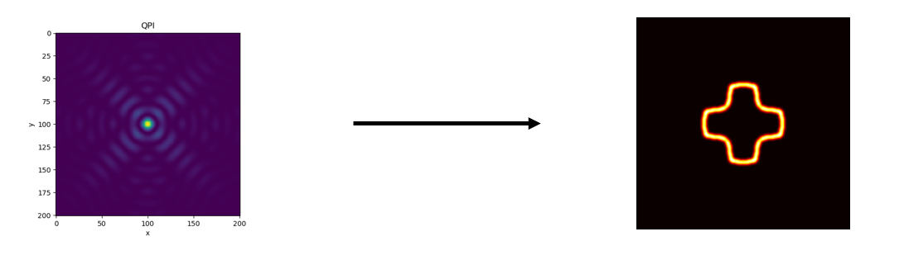

# 扫描隧道显微镜散射解金属等能面

提示：如果你无法渲染其中的公式，请阅读 `README.pdf`，二者内容相同。

## 物理背景

探索晶体材料的新奇电子结构是凝聚态物理学的重要课题之一。

### 扫描隧道显微学（STM）

扫描隧道显微学（Scanning tunneling microscopy, STM）与隧道谱学（Scanning tunneling spectroscopy, STS）能够直接测量材料表面原子晶格结构与能态密度（Density of states, DOS）。该测量方法对于探究材料表面态（Surface state）或石墨烯等层状材料的准二维电子结构则更加具有优势。

### 扫描隧道显微镜

扫描隧道显微镜利用量子隧穿效应，对探针和表面之间的隧穿电流大小的探测，可以观察表面上单原子级别的起伏。

  
*扫描隧道显微镜结构 (from Wikipedia)*

通常认为扫描隧道显微镜（Scanning tunneling microscope, STM）探测到的都是实空间（Real-space）的信号，要想得到倒空间（k-space）的信息还得依赖于其它具有动量分辨能力的测量手段。例如，角分辨光电子谱（Angle-resolved Photoemission Spectroscopy , ARPES）是一种能直接获得电子动量与能量的测量方法。

**那么，我们有没有可能同时获得实空间与动量空间的信息呢？或者说，我们有没有可能从实空间的图像中找出动量空间的信息呢？**

### 傅里叶变换隧道谱学（FT-STS）

我们知道实空间与动量空间之间存在傅里叶变换的关系，因此可以尝试使用傅里叶变换的手段从STM 测到的实空间图像中获得动量空间的信息，进而对能带结构进行进一步深入的研究。这类方法被称作傅里叶变换隧道谱学（Fourier Transform STS, FT-STS）的方法，

那么 FT-STS 的基本原理是怎样的呢？我们通过 STM 测量样品在某个能量上各处的局域能态密度（Local DOS）。当样品上有杂质时（真实材料中往往如此），该处的波函数将被散射。由于该散射过程通常是相干的，入射波与反射波将相干叠加形成驻波，对局域能态密度形成调制，所形成的波纹状图案通常被称为准粒子干涉（Quasiparticle Interference, QPI）图样。

  
*铜表面二维电子气的 QPI 图样及其 FFT [Nat. Commun. 6, 8691 (2015)]*

利用对 QPI 分析，人们研究了石墨烯（Graphene）[Science 317, 219–222 (2007)]，铜氧化物高温超导体（High-Tc Cuprate Superconductors）[Science 297, 1148–1151 (2002)]、铁基超导体（Fe-based Superconductors）[Nat. Commun. 7, 10565 (2016)]等新奇材料的电子结构，极大促进了人类对物质世界的认识与理解。

### 固体物理中实空间与相空间的关系

布洛赫定理告诉我们， 周期性势场作用下，薛定谔方程的解将呈现布洛赫波的形式
$$
\psi(\vec{r})=e^{i \vec{k} \cdot \vec{r}} u(\vec{r})
$$
其中 $ u(\vec{r}) $ 是周期函数，满足 $ u(\vec{r})=u\left(\vec{r}+\overrightarrow{R_{n}}\right) $ 

由于周期性势场中的布洛赫波具有周期函数的性质，我们可以用类似于时域中的周期信号的处理方法，对实空间做二维傅里叶变换，得到k空间。具体而言，k空间是一个以傅里叶变换后得到的倒格矢为基矢的离散的格点空间。粒子在倒空间上的某点上意味着它处于某一能量本征态，进而每一点都有确定的能量测量值。

由诺特定理，每一种连续对称性对应一个守恒量。由于真空有空间不变性，这导致了真空中的动量守恒。然而，固体中晶格的出现打破了一部分空间不变性，把连续对称变成了有限周期对称。这时，粒子动量在周期场调制下不再守恒，但仍然有一个东西“准守恒”，那就是准动量。

类比对一维粒子位形空间的波函数进行傅里叶变换时，选择的基函数是 $ \exp (ikx) $，动量本征态，这里的k就代表动量。

在有晶格周期的固体物理中进行傅里叶变换时，选择的基函数是 $ \exp (ikx) u_k(x) $，这里的k不再是严格意义上的动量，称为**准动量**。

**等能面：** 晶体中电子的准经典运动主要取决于E-k关系，为了表示实际晶体的复杂的能带结构，常常使用**等能面**来反映E-k关系，所谓等能面是指由k空间的能量相同的各点构成的曲面。

在示意图中我们可以看到：

- 第三列为扫描电镜得到的真实实验结果（实空间）
- 第二列为真实实验结果经过二维傅里叶变换FFT之后的图像
- 第一列为我们的目标：干净的等能面结构


### 大作业目标

总结上面提到的固体物理背景，动量空间中的信息通过散射过程投射到了实空间的数据中。因此，通过对实空间图像进行傅里叶变换，我们将能得到驻波的波矢信息，进而推断出等能面（Isoenergic Surface）的结构。

本大作业旨在同学们掌握通过局域态密度图（Local DOS Map）得到二维等能面结构（Isoenergic Surface）的基本原理与相关数据处理方法。

由于作业的评分一致性要求，我们不采用真实QPI数据上的结果作为评分依据，而以模拟的方式进行两个阶段的模拟任务：

- 大作业第一阶段（simulation）：即利用假设的动量空间等能面结构，生成中心散射点（两种不同类型的杂质）附近区域的局域态密度图，即 QPI 图样。
  - 这一阶段的目的是让大家熟悉物理背景，了解数据的格式，通过模拟知道QPI数据理论上的生成机制
- 大作业第二阶段（data mining）：第一阶段的逆过程，即通过给定的QPI 图样数据反推动量空间等能面结构。
  - 这一阶段的目标是真正从（模拟的）QPI图样数据中找到等能面结构，以给定的模拟数据作为评分标准，如果结果较好可以进一步在真实的QPI实验数据中应用。




## 数据说明

### 输入数据说明

100 份不同的等能面附近的态密度分布，存在 `dos-momentum` 中。每份数据是一个 `HDF5` 文件，文件中 `/isoE` 是一个 `(201, 201)` 的二维数组，数字代表电子在倒空间中的态密度。其中倒空间的单位为任意值，态密度的归一常数也是任意值：在本问题中，只有相对强度有明确的物理意义。

### 输出数据要求

`dos-position` 代表普通散射中心的实空间，`dos-position/m` 代表磁性散射中心的实空间，`dos-position/damp` 代表衰减的普通散射中心的实空间，`dos-position/m/damp` 代表衰减的磁性散射中心的实空间。

将以上的路径中 `dos-position` 替换成 `STM`，则对应相应输出数据的可视化图。

输入数据的可视化图在 `p_momentum` 目录中。

## 作业要求（功能部分）

### Makefile

本次作业提供了 Makefile，最终助教也将使用 Makefile 进行测试。需要注意，你在编写所有程序文件时，都应该使用 make 给程序传入的参数（来自 `sys.argv`），而非硬编码下面提到的任何文件名或文件编号等信息；否则，你可能无法通过测试。

在本目录中运行 `make -n` 即可看到实际运行的命令，这或许能帮助你开发。

### 基本要求

作业基础要求分成以下几个部分，完成各个任务即可拿到相应分数。

| 任务（程序名）   | 功能                     | 分数 |
| ---------------- | ------------------------ | ---- |
| scatter.py       | 从动量空间生成实空间     | 40   |
| gimage.py        | 实空间/倒空间可视化      | 20   |
| damping.py       | 生成考虑距离衰减的实空间 | 12   |
| multi_scatter.py | 生成多散射点叠加的实空间 | 8    |

以下是三个文件具体的输入输出格式要求。

#### `scatter.py`

读取 `dos-momentum/%.h5`，输出 `dos-position/%.h5`，其中`%`代表从 `0000` 到 `0099` 的字符串。以 `dos-momentum/0023.h5` 程序的调用形式形如：

```bash
python3 scatter.py 0 dos-momentum/0023.h5 dos-position/0023.h5
```

其中第一个参数 `0` 代表普通散射中心模式，即入射波和出射波在散射中心没有相位差。如果第一个参数是 `1`，代表磁性散射中心模式，即入射波和出射波在散射中心有 $\pi$ 的相位差。

设倒空间（k空间）的态密度为 $f(\mathbf{k})$, 当散射中心在实空间原点时，实空间的态密度为：

$$
D(\mathbf{r}) = \int \mathrm{d}\mathbf{k}_1 f(\mathbf{k}_1) \left|\int \mathrm{d}\mathbf{k}_2 f(\mathbf{k}_2) (e^{-i\mathbf{k}_1\mathbf{r}} + e^{-i\mathbf{k}_2\mathbf{r}})\right|^2
$$

如果散射中心有磁性，即 `sys.argv[1]` 为 `1` 时，需要给出射波填加一个 $\pi$ 的相位：

$$
D(\mathbf{r}) = \int \mathrm{d}\mathbf{k}_1 f(\mathbf{k}_1) \left|\int \mathrm{d}\mathbf{k}_2 f(\mathbf{k}_2) (e^{-i\mathbf{k}_1\mathbf{r}} + e^{-i(\mathbf{k}_2\mathbf{r} + \pi)})\right|^2 
$$

如果有多个散射点，态密度为多个散射点的叠加：
$$
D = D(\mathbf{r_1}) + D(\mathbf{r_2}) \\
= \int \mathrm{d}\mathbf{k}_{11} f_1(\mathbf{k}_{11}) \left|\int \mathrm{d}\mathbf{k}_{12} f_1(\mathbf{k}_{12}) (e^{-i\mathbf{k}_{11}\mathbf{r}} + e^{-i\mathbf{k}_{12}\mathbf{r}})\right|^2 \\
+ \int \mathrm{d}\mathbf{k}_{21} f_1(\mathbf{k}_{21}) \left|\int \mathrm{d}\mathbf{k}_{22} f_1(\mathbf{k}_{22}) (e^{-i\mathbf{k}_{21}\mathbf{r}} + e^{-i\mathbf{k}_{22}\mathbf{r}})\right|^2
$$

#### `gimage.py`

读取实空间（当 `sys.argv[1]`  为`1`）或倒空间（当`sys.argv[1]` 为 `0`）的二维态密度数组，画出可以表征二维标量场的图形。以 `dos-momentum/0023.h5` 为例，程序的调用形式形如：

```bash
python3 gimage.py 0 dos-momentum/0023.h5 p_momentum/0023.png
```

注意标注横纵坐标的标签、图的标题。

提示：备选之一为 `matplotlib.pyplot.imshow`。

#### `damping.py`

对理想条件下的散射态密度依距离衰减：

$$
 D^*(\mathbf{r}) = D(\mathbf{r}) e^{-|\mathbf{r}| / L} 
$$

其中 $L=20$ 为衰减长度，定为 20 个实空间像素单位。程序的调用形式形如：

```bash
python3 damping.py dos-position/0058.h5 dos-position/damp/0023.h5
```

#### `dos-position/%.h5`

`dos-position` 各级目录下的 `.h5` 文件中，都使用名为 `/QPI` 的 `(201,201)` 二维数组来存储实空间的 QPI 图样。

#### `multi_scatter.py`

多散射点叠加干涉：

**注意本题需要叠加七个等能面，仅需要生成一张图片**

在实空间进行平移，使生成散射点不在图像中心，并生成存在多个散射点叠加干涉的 QPI 图样。

本题中选择叠加的七个等能面序号为：58, 67, 43, 83, 12, 40, 18.
生成QPI实空间路径为`dos-multi-position`，散射中心参考`multi_scatter_position.csv`

程序的调用形式为：

```bash
python3 multi_scatter.py 0 multi_scatter_position.csv dos-position/0058.h5 dos-position/0067.h5 dos-position/0043.h5 dos-position/0083.h5 dos-position/0012.h5 dos-position/0040.h5 dos-position/0018.h5 dos-multi-position/0001.h5
```

### 提高要求

提高要求为加分项，至多可加 10 分。

可以参考的提高要求选题：

* 为不同散射过程指定不同散射概率。即对于一组 $(\mathbf{k}_1,\mathbf{k}_2)$，其发生概率P依赖于 $\mathbf{k}_1$ 和 $\mathbf{k}_2$。而在基本要求中，我们认为不同散射过程是等概率的。可以采用的形式如：

$$
P(\mathbf{k}_1,\mathbf{k}_2 )=\frac{1}{2}\left( 1-\frac{\mathbf{k}_1 \cdot \mathbf{k}_2}{\left| \mathbf{k}_1 \right| \left| \mathbf{k}_2 \right|} \right)
$$

​或者用矩阵形式进行任意指定。

- 生成二维石墨烯的QPI图像

  参考文献：Rutter, G. M., Crain, J. N., Guisinger, N. P., Li, T., First, P. N., & Stroscio, J. A. (2007). Scattering and interference in epitaxial graphene. *Science*, *317*(5835), 219-222.

  

如果你实现了任何提高要求，请在实验报告中详细说明你的工作，这将作为评分的依据。

## 作业要求（非功能部分）

非功能部分的要求详见大作业公告，此部分占20分。
